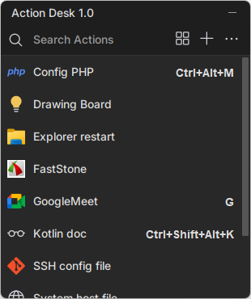
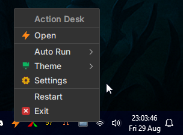
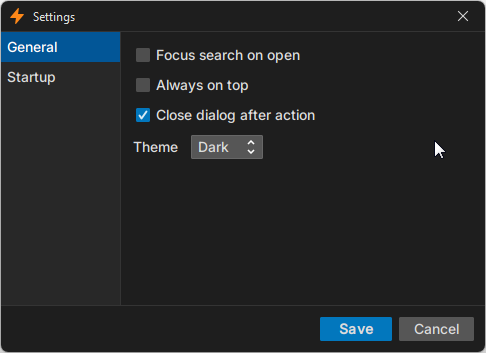

# ⚡Action Desk — Commands at your fingertips

---

Action Desk is a lightweight Windows utility that acts as your universal command center.
Run any command — CLI, script, `.exe`, or system action — from one simple, central UI.

🚀 Fast & simple – trigger commands instantly with a click or shortcut.  
🖥️ Universal – works with command-line tools, scripts, and executables.  
🌐 Community-powered – install and share ready-to-use commands.  
🪶 Minimal & clean – simple, distraction-free interface.  
📏 Small footprint – final jar around `50MB`, easy to download and run.

# 📷Action Desk Screenshots

---
| Action Desk                          | Tray Icon Integration                          | Settings UI                                   |
|--------------------------------------|------------------------------------------------|-----------------------------------------------|
|  |  |  |


# 🚀 Getting Started

1. **Download the latest JAR**  
   Grab the latest `ActionDesk.jar` from the [Releases](https://github.com/csabdulahad/action-desk/releases) page.

2. **Run the app**  
   Double-click the JAR or run from terminal/command prompt:

   ```bash
   java -jar ActionDesk.jar
    ```


# 💻OS Support

---
Action Desk currently provides **full support for Windows**.  
We plan to extend support to **Linux** and **Mac** in future releases.


# 🤝 How to Contribute

---

We welcome contributions from everyone! 🎉

Check out the **[Issues](https://github.com/csabdulahad/action-desk/issues)** page to find tasks and features that you can help implement.

- 🐛 **Bug Fixes** – Found something broken? Fix it and submit a pull request.
- ✨ **New Features** – Help us add useful commands or improvements.
- 📝 **Documentation** – Improve our README or add examples for users.

Every contribution counts and helps make Action Desk better for everyone! 🚀